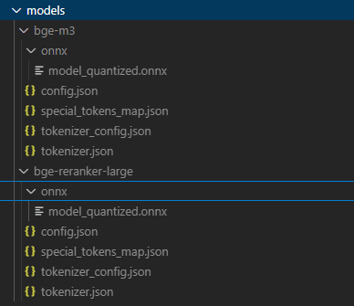

## 工程结构

```text
bright-brain/
├── .vscode/                  # vscode配置信息
├── chrome-extension/         # 独立的chrome插件代码
├── cli/                      # 独立的cli命令行工具
├── electron/                 # Electron 主进程相关代码
│   ├── backend               # 主要代码逻辑
│   │     ├── server          # 在线http服务
│   │     ├── service         # 主要业务逻辑，包含agent/mcp、对话、命令行服务、rag（向量模型、数据库）、本地数据库、知识处理、会话消息、设置等
│   │     ├── util            # 工具类
│   ├── main.ts               # 主进程入口
│   └── preload.ts            # 预加载脚本
├── mcp-server/               # 独立的mcp server样例（Stdio模式和StreamableHTTP模式）
├── src/                      # Vue 渲染进程文件夹
│   ├── components/           # 公共组件 (本项目主要用 Views)
│   ├── router/               # 路由配置
│   ├── services/             # 页面会用到的一些逻辑
│   ├── styles/               # 样式
│   ├── types/                # 实体、通信接口定义
│   │   └── electron.d.ts
│   ├── views/                # 页面视图
│   │   ├── ChatView.vue          # 聊天页面
│   │   ├── SearchView.vue        # 搜索页面
│   │   └── SettingsView.vue      # 设置页面
│   ├── App.vue               # Vue 根组件
│   └── main.ts               # Vue 入口
├── index.html                # Vite 入口 HTML
├── package.json
├── tsconfig.json
├── tsconfig.node.json
└── vite.config.ts
```

## 开发启动

1. RAG目前使用的本地embedding模型和rerank模型，需要按下图将模型相关文件下载到本地model目录

embedding模型下载地址：
https://hf-mirror.com/Xenova/bge-m3/
rerank模型下载地址：
https://hf-mirror.com/Xenova/bge-reranker-large

2. F5启动调试即可