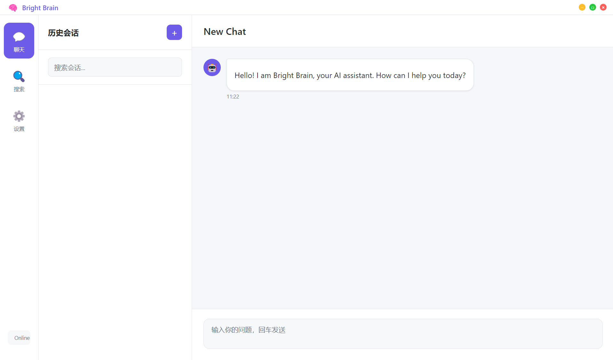

# 从零搭建我的"数字化外脑"：AI应用实战与复盘笔记
## 写在前面
坦白说，这并不是一份科班出身的AI课程，也不是什么大神的实战指南。
这一系列的内容，大多诞生于上下班拥挤的地铁、周末慵懒的午后，以及那些原本可能被用来刷短视频的"垃圾时间"。是的，过去两年里，我只是一个非常业余的AI技术"野生玩家"。
从ChatGPT横空出世时的惊艳，到后来大模型如雨后春笋般爆发，我就像个患了"松鼠症"的囤积狂：收藏夹里塞满了各种AI技巧、API文档和工具推荐，硬盘里堆满了各种跑了一半的开源代码——资料很丰富，但也乱得像我们家娃的书包。
直到前几个月换电脑做数据迁移时，我才意识到一个问题：零散的知识点，就像散落在地上的积木。如果不能拼搭起来，它们不仅毫无用处，踩上去还很疼。
痛定思痛，我决定把这两年的"野路子"收收心，做一次彻底的系统性复盘。
这不仅是为了给自己两年的"碎片化学习"一个交代，更是为了完成一个"工程化"的闭环 ——把"听说过"变成"能干活"。我希望通过这次整理，真正打造一个服务于我日常工作生活的"数字化外脑"。
两年的碎片时间，究竟能拼凑出什么？我也没有最终答案，但我决定把它写出来，希望能给同样想了解AI应用、却没时间翻阅海量教程的朋友，提供一份"拿来即用"的参考。


***

# 01. AI初体验：让AI帮我"编"出一个应用外壳

"数字化外脑"，其实是想做一个桌面程序，所以第一步得有个能看见、能摸着的界面。

非常遗憾的是我的前端知识非常欠缺。现在的 `Vue`、`Vite`、`Electron`……听起来都很厉害，但我这一把老骨头（其实是懒）实在不想从头啃文档了。

好在，现在是 AI 时代。以前写代码靠手，现在完全可以靠"嘴遁"。

今天这第一篇就来挑战一下：一行代码不写，只靠一张嘴，让 AI 帮我生成一个现代化的桌面应用外壳。

为了照顾刚入坑的朋友，我准备每篇文章都对几个名词进行简单科普。

---

## 非著名术语瞎解释

### 1. LLM (Large Language Model / 大语言模型)
*   **专业版**：是通过在海量数据上训练、基于Transformer架构的深度学习模型，其核心能力源于对语言统计规律的掌握和上下文关系的理解，而非真正的意识或认知……
*   **瞎解释版**：一个**读了互联网上几乎所有书的"鹦鹉"**。
    *   它其实并不懂逻辑，它只是根据上一个字，疯狂猜下一个词大概率是什么。比如前面说"床前明月光"，它脑子里概率最高的就是"疑是地上霜"，而不是"喝了一碗汤"。
    *   **我们用的工具**：ChatGPT、DeepSeek、豆包，背后其实都是这只鹦鹉的不同品种。

### 2. Token (词元)
*   **专业版**：Token是文本被分割后可供模型处理的最小意义单元，它作为文本数据与数字表示之间的桥梁，是大型语言模型理解和生成语言的基础……
*   **瞎解释版**：**AI 界的"计费单位"**。就像去菜市场买肉按"斤"算，去 AI 那里买文字就按"Token"算。每种模型都有自己的token计算方式，总之和 AI 聊得越多，消耗的 Token就 越多，如果是付费模型，也就是钱花的越多。

### 3. Prompt (提示词)
*   **专业版**：是用户提供给模型的指令或上下文信息，用以引导和约束模型生成特定、符合预期的输出……
*   **瞎解释版**：**"哄"AI干活的话术**。这玩意儿就是咒语。咒语念对了，AI 就无所不能；咒语念错了，AI 就是个听不懂人话的智障。

---

## Prompt 编写技巧

很多人可能会抱怨：AI压根没这么神奇，它每次都是在一本正经的胡说八道
通常原因只有一个：**把 AI 当成了肚子里的蛔虫，它肯定知道我想要啥。**

比如只是对 AI 说："*给我写一个聊天软件。*"
AI 的内心戏是："*大哥，用 React 还是 Vue？要不要后端？长什么样？是要微信这样么？算了，我随便给你整一个吧。*"
于是，它就"拉了一坨...."。

一般来说一个比较好的Prompt，应该包含以下四个要素：

1.  **立人设 (Role)**：告诉 AI 它是谁（比如：资深前端架构师）。
2.  **给背景 (Context)**：你要做什么，有什么可能会用到的知识（想要实现一个桌面程序）。
3.  **给约束 (Constraints)**: 限制范围、长度、风格或禁止事项（使用vue3+electron实现，代码以markdown格式输出）。
4.  **提任务 (Requirements)**：具体要有哪些功能,最好带上样例/草图（要有chat聊天、知识搜索以及设置页面）。

## 实战：生成我们的"外脑"骨架

### 核心 Prompt 展示

我要做的是一个桌面程序，目前基础要求的功能包含chat聊天、知识搜索，我对前端的要求是：**轻量、快、好看**。
按照prompt四要素，我的prompt如下：

**Role**: 你是一位资深前端架构师。

**Context**: 我需要你帮助我从零构建一个桌面端 AI 应用工程Bright-Brain。

**Constraints**:
 - Core: Electron, Vue3, Vite
 - Language: TypeScript
 - Router: Vue Router
 - UI Framework: Naive UI (因为它支持深色模式且组件丰富)
 - 首先给出完整的项目目录结构树，然后输出每个文件内容，用markdown形式输出
 - 确保代码可以直接运行，不要省略关键逻辑。

**Requirements**:
 界面布局采用经典的"左侧侧边栏 + 右侧内容区"结构：
 1. **Sidebar**: 包含三个主要导航图标：
    - Chat (聊天页面)
    - Search (搜索页面)
    - Settings (设置页面)
 2. **聊天页面**: 类似 ChatGPT 的布局。左侧是会话列表，底部输入框，无需发送按钮，直接回车发送，中间是当前会话的消息列表。内容使用Markdown 渲染，模拟流式输出。
 3. **搜索页面**: 上面是搜索输入框，无需搜索按钮，回车搜索。下面是搜索结果列表，每一条结果包含搜索内容简要信息、链接地址、关联度
 4. **设置页面**: 简单的表单布局，包含外观设置，可以设置主题（亮色和暗色），AI对话配置（包含请求端点baseurl输入、API Key输入、模型名输入），搜索配置（显示结果数量）。
 所有的后端逻辑，比如聊天、搜索、保存配置均使用方法模拟，后续会通过后端服务保存到数据库等介质中


### 见证奇迹的时刻

在AI应用端（个人比较喜欢用[Google AI Studio](https://aistudio.google.com/prompts/new_chat)）复制这段prompt，并发送后，AI会先给你画出一个漂亮的目录结构（这是我得到的真实结果）：

```text
bright-brain/
├── electron/                 # Electron 主进程文件夹
│   ├── main.ts               # 主进程入口
│   └── preload.ts            # 预加载脚本
├── src/                      # Vue 渲染进程文件夹
│   ├── assets/               # 静态资源
│   ├── components/           # 公共组件 (本项目主要用 Views)
│   ├── layout/               # 布局文件
│   │   └── AppLayout.vue     # 核心布局：侧边栏 + 路由视图
│   ├── router/               # 路由配置
│   │   └── index.ts
│   ├── services/             # 模拟后端服务 logic
│   │   ├── mockChat.ts       # 模拟 AI 对话流
│   │   └── mockSearch.ts     # 模拟搜索服务
│   ├── styles/               # 样式
│   │   └── variables.css
│   │   └── style.css
│   ├── types/                # TS 类型定义
│   │   └── electron.d.ts
│   ├── views/                # 页面视图
│   │   ├── ChatView.vue          # 聊天页面
│   │   ├── SearchView.vue        # 搜索页面
│   │   └── SettingsView.vue      # 设置页面
│   ├── App.vue               # Vue 根组件
│   └── main.ts               # Vue 入口
├── index.html                # Vite 入口 HTML
├── package.json
├── tsconfig.json
├── tsconfig.node.json
└── vite.config.ts
```

接着，它会给出 `package.json` 等文件的内容。只需要在vscode中按照目录结构创建对应的目录/文件，填入文件内容。接着在根目录下执行

```bash
npm install
```
成功后再执行
```bash
npm run dev
```

**Biu！** 💥
一个带有左侧导航栏、页面路由跳转的桌面应用窗口，就这么弹出来了。


如果过程中有错误，或者存在页面布局等问题，可以继续跟AI对话，让它根据错误信息/调整需求对应用进行逐步完善。


## 下集预告

现在，我有了一个**"植物人"**状态的外脑——它有漂亮的躯壳（UI），但脑子是一片空白。如果在这个界面输入"你好"，它只会模拟输出一些信息。

下一篇，我要给它注入**灵魂**，让它真正连接AI，像 ChatGPT 一样，实现"打字机"那种突突突往外吐字的效果。
